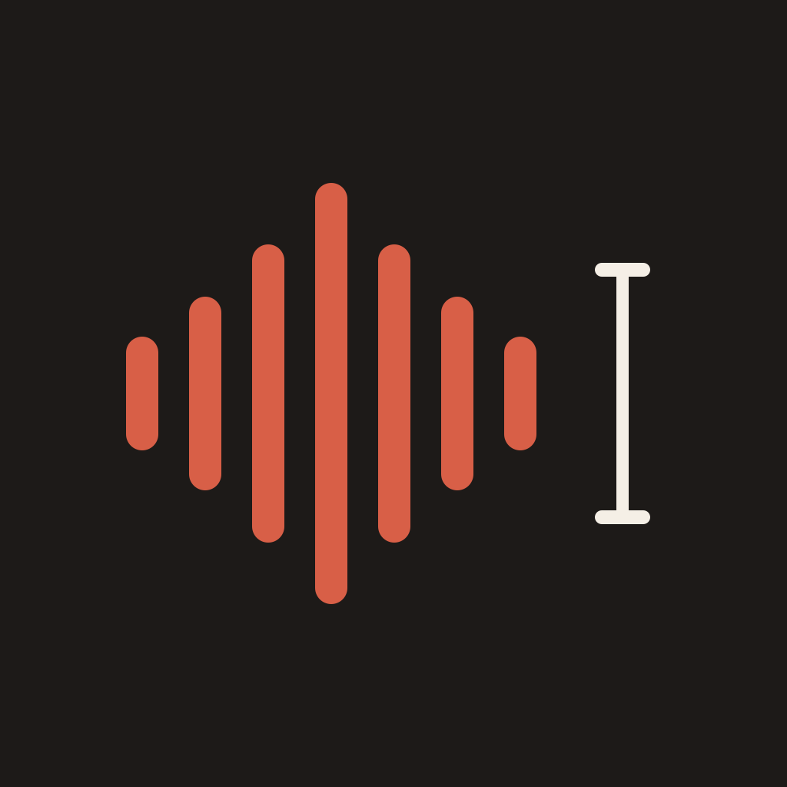

<p align="center">
  
</p>

<h1 align="center">ListenToMe</h1>

<p align="center">
  Fast, native macOS dictation powered by OpenAI's GPT Live Transcribe.
</p>

ListenToMe lives in your menu bar. Press a shortcut anywhere, speak, and your
words land in the app you were using.

## Highlights

- Hold to talk or tap to toggle, with a fully customizable shortcut
- Live partial transcripts with custom words and language hints
- Focus-safe pasting with automatic clipboard fallback
- Local history with editable transcripts and replayable audio
- API key stored in macOS Keychain
- No accounts, analytics, cloud history, or extra model providers

## Run it

ListenToMe requires macOS 14 or newer, Xcode, and an OpenAI Platform API key.

```sh
./Scripts/package-app.sh
open dist/ListenToMe.app
```

Add your API key in **Setup**, then grant Microphone and Accessibility access
when macOS asks. OpenAI API usage is billed separately from ChatGPT and Codex
subscriptions.

## How it works

`Shortcut → microphone → GPT Live Transcribe → cursor`

Audio is streamed as 24 kHz PCM through an OpenAI Realtime transcription
session using [`gpt-live-transcribe`](https://developers.openai.com/api/docs/models/gpt-live-transcribe).
The app keeps transcript history and recorded audio locally on your Mac.

## Develop

```sh
./Scripts/test.sh
./Scripts/package-app.sh
```

Local packages are ad-hoc signed. For a Developer ID build on your Mac:

```sh
export CODESIGN_IDENTITY="Developer ID Application: Anouar Mansour (K32684A887)"
./Scripts/package-app.sh
```

## Updates

Released builds use [Sparkle](https://sparkle-project.org) and check
[GitHub Releases](https://github.com/Hankyone/ListenToMe/releases) for new
versions. Use **Check for Updates…** in the menu bar or app menu.

## Releasing

1. Bump `CFBundleShortVersionString` and `CFBundleVersion` in
   [`Resources/Info.plist`](Resources/Info.plist).
2. Optionally write short notes in `RELEASE_NOTES.md`.
3. Commit, tag, and push:

```sh
git tag v0.3.0
git push origin main v0.3.0
```

The tag must match `v` + the short version string. GitHub Actions builds,
notarizes, uploads `ListenToMe-X.Y.Z.dmg` (installer), `ListenToMe-X.Y.Z.zip`
(Sparkle updates), and `appcast.xml`, then publishes the release.

### Required repository secrets

| Secret | Value |
|--------|--------|
| `MACOS_CERTIFICATE_P12_BASE64` | Base64-encoded Developer ID Application `.p12` |
| `MACOS_CERTIFICATE_PASSWORD` | Password for that `.p12` |
| `APPLE_ID` | Apple ID used for notarization |
| `APPLE_APP_SPECIFIC_PASSWORD` | App-specific password from appleid.apple.com |
| `APPLE_TEAM_ID` | `K32684A887` |
| `SPARKLE_PRIVATE_KEY` | Contents of `.secrets/sparkle_eddsa_private.key` |

Export the certificate once:

```sh
base64 -i DeveloperID.p12 | pbcopy
```

The Sparkle EdDSA private key lives in `.secrets/` (gitignored). The matching
public key is already in `Info.plist` as `SUPublicEDKey`.

Local notarized release (same secrets as env vars):

```sh
./Scripts/release.sh
```

This is an early MVP. Issues and focused pull requests are welcome.

## License

[MIT](LICENSE)
